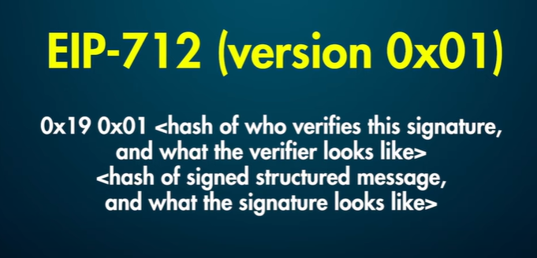
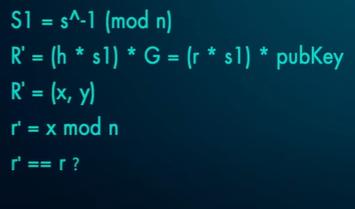

1. merkle trees
2. Merkle Proof
3. second pyramid attack


## Timestamp 
1:04:24:44 Generating Merkle Tree and Proofs
1:04:40:48 Writing tests
1:04:58:50 EIP 191 and EIP 712
1:04:59:30 Why did we need them
1:05:00:04 Simple Signature verification without the standards
1:05:01:51 EIP 191 Signature and Verification
1:05:10:12 ECDSA Signature and What are v, r and s value
1:05:20:20 Transaction types
1:05:39:49 Implementing signature verification
1:05:48:03 Modifying the tests
1:05:51:57 Testing on zkSync(optional)


## EIP 191

1. 0x19<1 byte version> <version specific data><data to sign>
   1. 


## EIP 712

1. Structured data to sign
   1. 0x19 0x01 <domainSeparator> <hashstruct(message)>
   2. <domainseparator> -> <hashStruct(eip712Domain)>

 ```Solidity
 struct eip712Domain = 
 { 
    
    string name, 
    string version, 
    uint256 chainld, 
    address verifyingContract, 
    bytes32 salt  
}
 ```


```Solidity
// 
hashStruct(structData) = keccak256(typeHash || hash(structData))
// here is the hash of our EIP721 domain struct
bytes32 constant EIP71200MAIN_TYPEHASH = 
keccak256("EIP7lzDomain(string name,string version,uint256 chainId,address verifyingContract)");


// Here; we define what our "domain" struct looks like 
eip_712_domain_separator_struct = EIP712Domain(
    { 
        name: "SignatureVerifier", 
        version: "1",
        chainId: 1, 
        verifyingContract: address(this) 
    }
);

i_domain_separator = keccak256( 
    abi.encode( 
        EIP71200MAIN_TYPEHASH,
         keccak256(bytes(eip_712_domain_separaton_struct.name)), keccak256(bytes(eip_712_domain_separator_struct.version)), eip_712_domain_separator_struct.chainId, eip_712_domain_separator_struct.verifyingContract 
        ) 
    );
```

```Solidity
// message struct
struct Message{
    uint256 number;
}

bytes32 public constant MESSAGE_TYPEHASH = 
    keccak256("Message(uint256 number)");

// now, we can hash our message struct 
bytes32 hashedMessage = keccak256(
    abi.encode(
        MESSAGE_TYPEHASH, 
        Message({ number: message })
        )
    );

```



### Digest

1. The digest is the output of the hash function.
2. For example, sha256 has a digest of 256 bits, i.e. its digest has a length of 32 bytes.


## ECDSA


### What is a blockchain signatures

Blockchain Signatures 
1.  Provide authentication in blockchain technology 
2.  Verify that the message or transactions originates from the intended sender
3. Public Key cryptography

### Externally Owned Account

### use of ECDSA

1. 1. Generate key pairs 
2. Create Signatures
3. Verify Signatures


### Curve of ECDSA

1. secp2651 curve 
   1. generator point G random point
   2. Order n : prime number generated using G defines the lenght of private key
   3. (v,r,s)
   4. r -> x point
   5. S -> proof signer knows private key
   6. v: if positive or negative part of curve and polarity
2. signature malleability

### Generation of private key and pubkey

1. pubKey = p.G 

### creation of signature

1. first we hash the message
2. we create K nonce

```latex
R = k.G
R=(x,y)
r = x mod n; mod is modulo
```


### matching signature
1. 
2. reverse of signing


## Transaction type

1. Tx type??
   1. 0x0 --legacy
   2. 0x01 Optional Access lists additional accesslist parameter and gas saving on contract calls
   3. 0x02 EIP 1559 Tackle congestion and high gas fees,
      1.  gas price with base fees
      2.  Added parameters: 
          1.   maxPriorityFeePerGas 
          2.   maxFeePerGas (maxPriorityFeePerGas + baseFee)
   4. 0x03 Blob EIP4844
      1. Scaling solutions for rollups
      2. Additional fields
         1. max blob fee per gas
         2. blob versioned hashes
   5. ZKSYNC specific
      1. 0x71 EIP 712
         1. type 113 -> standardize message data structure
            1. access zksync account abstraction
            2. additional fields
               1. gasPerPubData
               2. customSignature
               3. paymasterParams
               4. factory_deps
      2. 0xff Priority transactions
         1. L1 -> L2 transactions

## EIP-4844 Blob transaction

1. After maybe 20-90 days it will be deleted Blob transaction
2. Sideccar and motorcycle 
3. Proto-DankSharding
4. Blockchain trilemma problem
5. rollups help